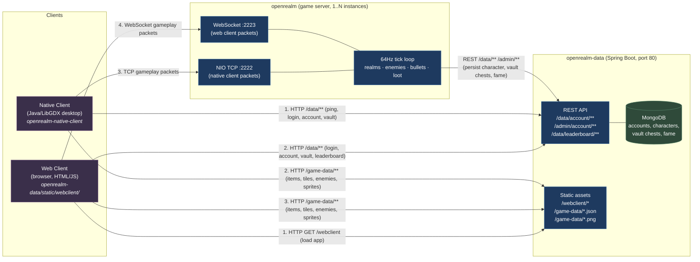

# OpenRealm Architecture

How the three repos fit together: `openrealm-data` (data service + Mongo + static asset host),
`openrealm` (game server), and the two clients (`openrealm-native-client` and the web client
shipped inside `openrealm-data`).

## Diagram

## Key flows

1. **Boot.** Both clients fetch JSON game data + sprite sheets from `openrealm-data`'s
   static endpoints (`/game-data/*`). The web client *itself* is also served from there;
   the native client is a packaged jar (`OpenRealm-x.y.z.exe` produced by `jpackage`).
2. **Auth & account.** Both clients hit `openrealm-data`'s REST API for login, character
   list, vault contents, and leaderboard.
3. **Live gameplay.** The web client opens a **WebSocket** to the game server on
   `:2223`; the native client opens a **TCP** socket to `:2222`. Both speak the same
   packet codec — the wire format is shared (`com.openrealm.net.*` packages), only the
   transport differs.
4. **Persistence.** The game server never writes to MongoDB directly — it calls
   `openrealm-data` over REST (`POST /data/account/{uuid}/chest`, etc., dispatched via
   `ServerGameLogic.DATA_SERVICE.executePost(...)` in `openrealm/`). Only
   `openrealm-data` holds a Mongo connection.
5. **Sprite assets** for the native client are pulled lazily over HTTP from
   `/game-data/*.png`, which is why the native client needs a reachable data-service
   URL even though the game socket is the gameplay channel.

## Ports & defaults

| Component                    | Default port | Override env       |
| ---------------------------- | ------------ | ------------------ |
| openrealm-data (HTTP/REST)   | 80           | `DATA_PORT`        |
| openrealm game server (TCP)  | 2222         | hardcoded          |
| openrealm game server (WS)   | 2223         | hardcoded          |
| MongoDB (used by data svc)   | 27017        | spring config      |

## Repo responsibilities

- **`openrealm-data`** — Spring Boot service. Owns the database. Serves the web client
  static bundle and shared game-data JSON / sprite PNGs at `/game-data/*`. Exposes the
  `/data/**` and `/admin/**` REST APIs that both clients and the game server consume.
  Single source of truth for accounts, characters, and vault contents.
- **`openrealm`** — Stateless game server. Holds in-memory realms, runs the 64Hz tick
  loop, accepts TCP (native) and WebSocket (web) clients on the shared packet codec.
  Persists state through `openrealm-data`'s REST API. Multiple instances can run
  behind a load balancer; each instance owns its own set of realms.
- **`openrealm-native-client`** — Java desktop client built on LibGDX, packaged via
  `jpackage` into a Windows installer (see `pom.xml` `installer-windows` profile and
  `.github/workflows/release.yml`). Consumes the same REST API and packet codec as the
  web client.
- **web client** (lives under `openrealm-data/src/main/resources/static/webclient/`) —
  Plain HTML/JS, no build step. Loaded directly from the data service.
